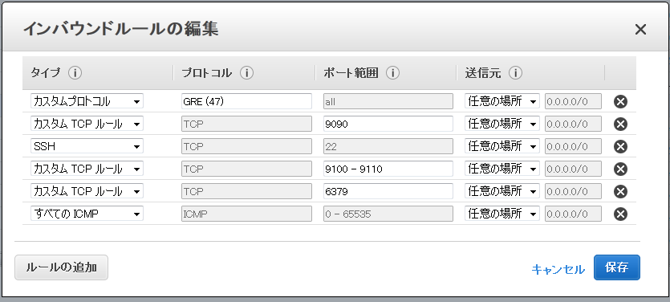

# AWS上でOpenVNetを使ったセグメント越えの検証

## 構成イメージ
下図に示す構成を作成する。

## EC2インスタンスの準備
[Step1](./ovn_on_aws_step1.md)を参考に・・・

1. IPアドレスの帯域が異なる二つのVPCを用意する（以下、VPC0とVPC1とする）
  - 上の図では172.31.0.0/20(VPC0) と192.168.0.0/20(VPC1) の2つを用意
1. VPC0とVPC1それぞれに、セキュリティグループの作成をする
  - インバウンドを次のように設定する。
    - カスタムプロトコル: 47 : すべて
  - SSH : TCP : 22
  - すべてのICMP : すべて : 該当なし
  - 他、OpenVNetが通信に使用するTCPポートを空けておく
  

1. EC2インスタンスの作成
  - VPC0に、OpenVNetを稼動させるSV0と、接続ノードになるNODE1を作成する
  - VPC1に、OpenVNet(vnaのみ)を稼動させるSV1と、接続ノードになるNODE2を作成する
  - それぞれ、NIC1つ(eth0のみ)で構成
2.

## OpenVNetがデフォルトで使用するポート
|name|port no|
|:--|-:|
|redis|6379|
|MySql|3306|
|ovn-vna|9103|
|ovn-vnmgr|9102|
|ovn-webapi|9101|
|vnctl|9090|
