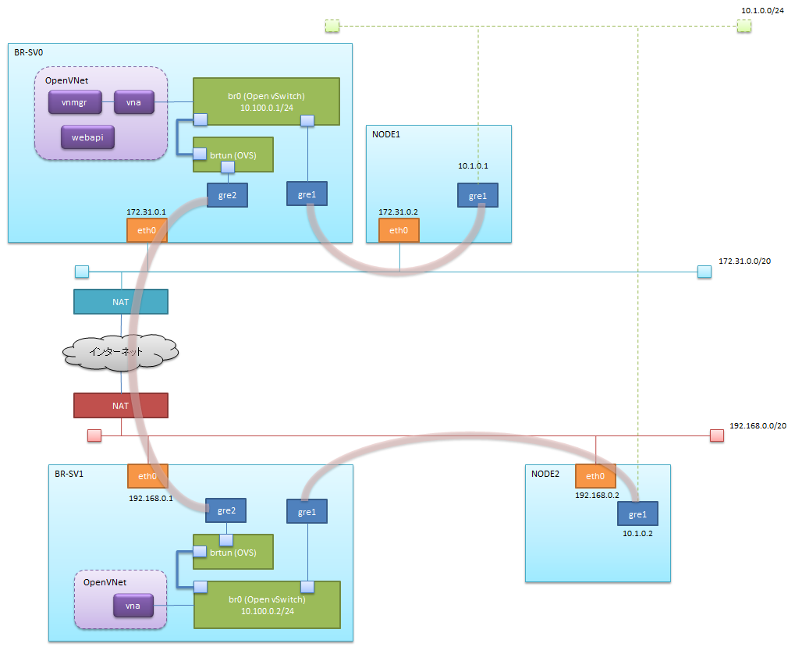

# AWS上でOpenVNetを使ったセグメント越えの検証

## 構成イメージ
下図に示す構成を作成する。



## EC2インスタンスの準備
[Step1](./ovn_on_aws_step1.md)を参考に・・・

1. IPアドレスの帯域が異なる二つのVPCを用意する。（以下、VPC0とVPC1とする）
  - 上の図では172.31.0.0/20(VPC0) と192.168.0.0/20(VPC1) の2つを用意
1. VPC0とVPC1それぞれに、セキュリティグループの作成をする。
  - インバウンドを次のように設定する
    - カスタムプロトコル: 47 : すべて
    - SSH : TCP : 22
    - すべてのICMP : すべて : 該当なし
    - 他、OpenVNetが通信に使用するTCPポートを空けておく
  

1. EC2インスタンスの作成
  - VPC0に、OpenVNetを稼動させるSV0と、接続ノードになるNODE1を作成する
  - VPC1に、OpenVNet(vnaのみ)を稼動させるSV1と、接続ノードになるNODE2を作成する
  - それぞれ、NIC1つ(eth0のみ)で構成
2. 「ソース/宛先チェックの無効化」を無効に設定する。
    - EC2のインスタンスを選択し、[アクション]-[ネットワーキング]-[送信元/送信先の変更チェック]を選択する。

## OpenVNetがデフォルトで使用するポート
|name      |port no|
|:---------|------:|
|redis     |6379
|MySql     |3306
|ovn-vna   |9103
|ovn-vnmgr |9102
|ovn-webapi|9101
|vnctl     |9090

## 各インスタンスのIPアドレス
|VPC|host name| private| public (NAT) |
|---|---------|--------|--------------|
|VPC0|SV0|172.31.0.1|52.xxx.xxx.100|
|VPC0|NODE0|172.31.0.2|-
|VPC1|SV1|192.168.0.1|54.xxx.xxx.200|
|VPC1|NODE1|192.168.0.2|-

## 使用するスクリプトの取得と準備

### 各EC2インスタンスにログインし、githubから取得する
```
$ yum install -y git
$ git clone https://github.com/mao172/OpenVNet_on_AWS.git ./setup
$ cd ./setup
$ git checkout origin/feature/edge
```

## 事前準備
各EC2インスタンスにログインし、`initial_setup.sh`を実行する
```
$ ./bin/initial_setup.sh
```
このスクリプトによりiptablesが停止します。
また、SELinuxが`Enforcing`の場合`disabled`に設定し、rebootします。

## OpenVNetのインストール
SV0、SV1にログインし、'install_ovn.sh'を実行する
```
$ ./bin/install_ovn.sh
```

## Open vSwitchの設定
SV0にログインし、'setup_ovs.sh'を実行する
```
$ ./bin/setup_ovs.sh  02:01:00:00:00:01 10.100.0.1 patch00 54.xx.xxx.200
```

SV1にログインし、'setup_ovs.sh'を実行する
```
$ ./bin/setup_ovs.sh  02:01:00:00:00:02 10.100.0.2 patch10 52.xx.xxx.100
```
引数はそれぞれ、br0に設定する仮想MACアドレス、仮想IPアドレス、パッチポート名、相手先のグローバルIP（NATされた外側のIPアドレス）の順。
このスクリプトにより、Open vSwitchのbr0とbrtunが作成され、patchポートで接続された状態を作成する。
また、SV0とSV1がGRE接続された状態になる。

## NODE1,NODE2側のGRETapを作成する

NODE1,NODE2にそれぞれログインし、create_gretap.shを実行する

NODE1
```
$ ./bin/create_gretap.sh gre1 172.31.0.1 172.31.0.2 10.1.0.1/24
```
NODE2
```
$ ./bin/create_gretap.sh gre1 192.168.0.1 192.168.0.2 10.1.0.2/24
```
引数はそれぞれ、名前、送信先のIP、送信元のIP、仮想IPの順。 最後の仮想IPはサブネットマスク(/24)を付け忘れないこと。

次の2点を確認しておく。

- `ifconfig gre1`コマンドを実行し、正しく追加できているか確認する。
- `route -n`コマンドでルーティングテーブルにサブネット10.1.0.0に対して、追加したgre1を使用するように追加されていること。

```
# route -n
Kernel IP routing table
Destination     Gateway         Genmask         Flags Metric Ref    Use Iface
10.1.0.0        0.0.0.0         255.255.255.0   U     0      0        0 gre1
172.31.0.0      0.0.0.0         255.255.240.0   U     0      0        0 eth0
0.0.0.0         172.31.0.1      0.0.0.0         UG    0      0        0 eth0
```

## 疎通の確認
NODE1,NODE2それぞれから、相手の仮想IPに対してpingを打ち、確認する。


## OpenVNetのための設定
ここからOpenVNetのための設定を行っていく

### confファイルの編集
- vnaのidをユニークにする
- hostのipアドレスをデフォルトのローカルアドレスではなく、実際のプライベートアドレスを設定する。
- publicにはNATされた外側のIPアドレスを設定する。

#### SV0
```
$ vim /etc/openvnet/vna.conf

  node {
-   id "vna"
+   id "vna0"
    addr {
      protocol "tcp"
-     host "127.0.0.1"
-     public ""
+     host "172.31.14.15"
+     public "52.xx.xxx.100"
      port 9103
    }
  }
```
```
$ vim /etc/openvnet/vnmgr.conf

  node {
    id "vnmgr"
    addr {
      protocol "tcp"
-     host "127.0.0.1"
-     public ""
+     host "172.31.14.15"
+     public "52.xx.xxx.100"
      port 9102
    }
    plugins [:vdc_vnet_plugin]
  }
```
```
$ vim /etc/openvnet/webapi.conf

  node {
    id "webapi"
    addr {
      protocol "tcp"
-     host "127.0.0.1"
-     public ""
+     host "172.31.14.15"
+     public "52.xx.xxx.100"
      port 9101
    }
  }
```

#### SV1
```
$ vim /etc/openvnet/common.conf

  registry {
    adapter "redis"
-   host "127.0.0.1"
+   host "52.xx.xxx.100"
    port 6379
  }
```
```
$ vim /etc/openvnet/vna.conf

  node {
-   id "vna"
+   id "vna1"
    addr {
      protocol "tcp"
-     host "127.0.0.1"
-     public ""
+     host "192.168.7.214"
+     public "54.xx.xxx.200"
      port 9103
    }
  }
```
```
$ vi /etc/openvnet/vnctl.conf

  # webapi_protocol 'http'
- # webapi_uri  '127.0.0.1'
+ webapi_uri  '52.xx.xxx.100'
  # webapi_port '9090'
  # webapi_version '1.0'
  # output_format 'yml'
```

### Redisのセットアップ
SV0 側でのみ、redisのサービスを起動する。
外からの接続を許可するために、redis.confを編集する。

```
$ sed -i -E 's/bind [0-9]+\.[0-9]+\.[0-9]+\.[0-9]+/bind 0.0.0.0/g' /etc/redis.conf
$ service redis start
```

### Databaseのセットアップ
SV0 側でのみ、setup_database.shを実行する
```
$ ./bin/setup_database.sh
```

### OpenVNetのセットアップ
※ あらかじめ、NODE1とNODE2で作成したGRETapに振られたMACアドレスを調べておく。

NODE1
```
# ifconfig gre1
gre1      Link encap:Ethernet  HWaddr 92:00:8D:9F:72:6B
        inet addr:10.1.0.1  Bcast:0.0.0.0  Mask:255.255.255.0
        inet6 addr: fe80::9000:8dff:fe9f:726b/64 Scope:Link
        UP BROADCAST RUNNING MULTICAST  MTU:1450  Metric:1
        RX packets:64 errors:0 dropped:0 overruns:0 frame:0
        TX packets:64 errors:0 dropped:0 overruns:0 carrier:0
        collisions:0 txqueuelen:1000
        RX bytes:5984 (5.8 KiB)  TX bytes:6240 (6.0 KiB)
```

NODE2
````
$ ifconfig gre1
gre1      Link encap:Ethernet  HWaddr 1E:4B:E0:00:B7:85
        inet addr:10.1.0.2  Bcast:0.0.0.0  Mask:255.255.255.0
        inet6 addr: fe80::1c4b:e0ff:fe00:b785/64 Scope:Link
        UP BROADCAST RUNNING MULTICAST  MTU:1450  Metric:1
        RX packets:58 errors:0 dropped:0 overruns:0 frame:0
        TX packets:64 errors:0 dropped:0 overruns:0 carrier:0
        collisions:0 txqueuelen:1000
        RX bytes:5516 (5.3 KiB)  TX bytes:6240 (6.0 KiB)
```

SV0 側でのみ、vnmgrとwebapiを起動し、`setup_edge.sh`を実行する。
```
$ initctl start vnet-vnmgr
$ initctl start vnet-webapi
$ cat <<_EOF_ | ./bin/setup_edge.sh
dp-0 gre1 10.1.0.1 92:00:8D:9F:72:6B
dp-1 gre2 10.1.0.2 1E:4B:E0:00:B7:85
_EOF_
```

SV0、SV1でvnaを起動する。
```
$ initctl start vnet-vna
```

`ovs-ofctl dump-flows br0` コマンドを実行し、drop以外のフロー(actions=output:～)があることを確認しておく。

### 疎通の確認
sv1,sv2それぞれから、相手の仮想IPに対してpingを打ち、確認する。
