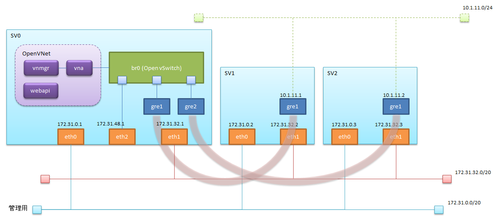

# OpenVNet P2V on AWS 仮想ネットワークオーバーレイ

## 構成イメージ

下図に示す構成を作成する。


[Step1](./ovn_on_aws_step1.md)との違い
- sv0にeth2を追加
- eth2をbr0につなぐ
- OpenVNetにルーターの設定を追加


## EC2インスタンスの準備
[Step1](./ovn_on_aws_step1.md)と同様にインスタンスを作成し、
sv0にはeth2を追加する。eth2のサブネットはeth0およびeth1とは異なるサブネットにする。

## 使用するスクリプトの取得と準備
各EC2インスタンスにログインし、githubから取得する
```
$ yum install -y git
$ git clone https://github.com/mao172/OpenVNet_on_AWS.git ./setup
$ cd ./setup
$ git checkout feature/p2v
```

## eth1の設定
  各EC2インスタンスにログインし、`create_eth1.sh`を実行する
  ```
  $ ./bin/create_eth1.sh
  ```

  sv0にログインし、`create_eth2.sh`を実行する

## OpenVNetのインストール
  sv0にログインし、'install_ovn.sh'を実行する
```
$ ./bin/install_ovn.sh
```

## Open vSwitchの設定
  sv0にログインし、'create_br0.sh'を実行する
```
 ./bin/create_ovsbr0.sh
```

OVS側のGREポートを`ovs-vsctl`コマンドを使用して作成する
```
$ ovs-vsctl add-port br0 gre1 -- \
    set interface gre1 \
    type=gre \
    options:local=172.31.32.1 \
    options:remote_ip=172.31.32.2 \
    options:pmtud=true

$ ovs-vsctl add-port br0 gre2 -- \
    set interface gre2 \
    type=gre \
    options:local=172.31.32.1 \
    options:remote_ip=172.31.32.3 \
    options:pmtud=true
```

設定の確認
```
$ ovs-vsctl show
```

## sv1,sv2側のGRETapを作成する
  sv1,sv2にそれぞれログインし、`create_gretap.sh`を実行する

sv1
```
$ ./bin/create_gretap.sh gre1 172.31.32.1 172.31.32.2 10.1.0.1/24
```

sv2
```
$ ./bin/create_gretap.sh gre1 172.31.32.1 172.31.32.3 10.1.0.2/24
```

## ルート設定

sv1
```
ip route add 172.31.48.0/20 via 10.1.11.1 dev gre1
```

sv2
```
ip route add 172.31.48.0/20 via 10.1.11.2 dev gre1
```

sv0
```
ip route add 10.1.11.0/24 via 172.31.48.1 dev br0
```

## 疎通の確認
- sv1,sv2それぞれから、相手の仮想IPに対してpingを打ち、確認する。
- sv1,sv2それぞれから、sv0 のbr0(eth2)のIP(172.31.48.1)に対してpingを打ち、確認する。
- sv0から、sv1、sv2の仮想IP(10.1.11.1 10.1.11.2)に対してpingを打ち、確認する。


## OpenVNetのための設定
  [Step1](./ovn_on_aws_step1.md) と同様に行うが、`setup_openvnet.sh`の代わりに`setup_openvnet_p2v.sh`を実行する。

### OpenVNetのセットアップ
  `setup_openvnet_p2v.sh`を実行する
```
$ cat <<_EOF_ | ./bin/setup_openvnet_p2v.sh
gre1 10.1.11.1 92:00:8D:9F:72:6B
gre2 10.1.11.2 1E:4B:E0:00:B7:85
_EOF_
```

### vnaの起動

```
initctl start vnet-vna
```

### 疎通の確認
  sv1,sv2それぞれから、相手の仮想IPに対してpingを打ち、確認する。
