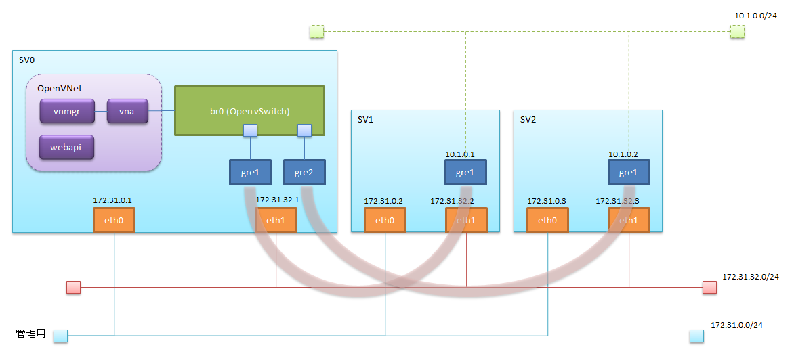
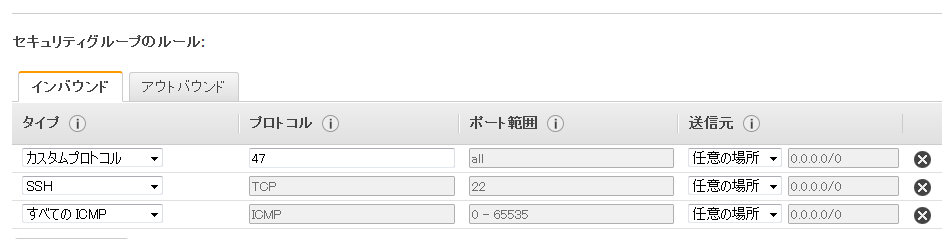

# AWS上でOpenVNetを使ってみる - Step1

## 構成イメージ

下図に示す構成を作成する。


## EC2インスタンスの準備

1. セキュリティグループの作成
  - インバウンドを次のように設定する。
    - カスタムプロトコル: 47 : すべて
    - SSH : TCP : 22
    - すべてのICMP : すべて : 該当なし
    
1. OpenVNetを稼動させるsv0と、接続ノードになるsv1、sv2を作成する。
  - OpenVNetの動作環境がCentOS6なので、「AWS Marketplace」から'CentOS 6 (x86_64) - with Updates'を選択してイメージを作成する。
  - インスタンスの詳細の設定でsv0、sv1、sv2が同じサブネットになるように設定する。
  - セキュリティグループの設定でsv0、sv1、sv2に先に作成したセキュリティグループを割り当てる。
  - NICを最初から2つに設定して作成すると、パブリックIPが割り当てられなくなるためNIC1つ(eth0のみ)で構成し、後から追加する。
2. 「ソース/宛先チェックの無効化」を無効に設定する。
  - EC2のインスタンスを選択し、[アクション]-[ネットワーキング]-[送信元/送信先の変更チェック]を選択する。
3. ネットワークインタフェースを作成し、各インスタンスにアタッチする。（eth1を追加する）
  - eth0とは異なるサブネットになるように設定する。
  - アベイラビリティゾーンはeth0と同じになるように設定する。
  - 先に作成したセキュリティグループを割り当てる。
  - 「送信元/送信先の変更チェック」を無効にする。
    - 作成したネットワークインタフェースを選択し、[アクション]-[送信元/送信先の変更チェック]を選択する。

## 使用するスクリプトの取得と準備
  各EC2インスタンスにログインし、githubから取得する
```
$ yum install -y git
$ git clone https://github.com/mao172/OpenVNet_on_AWS.git ./setup
$ cd ./setup
```

## eth1の設定
  各EC2インスタンスにログインし、`create_eth1.sh`を実行する
  ```
  $ ./bin/create_eth1.sh
  ```

## OpenVNetのインストール
  sv0にログインし、'install_ovn.sh'を実行する
```
$ ./bin/install_ovn.sh
```

## Open vSwitchの設定
  sv0にログインし、'create_br0.sh'を実行する
```
 ./bin/create_br0.sh
```

OVS側のGREポートを`ovs-vsctl`コマンドを使用して作成する
```
$ ovs-vsctl add-port br0 gre1 -- \
    set interface gre1 \
    type=gre \
    options:local=172.31.32.1 \
    options:remote_ip=172.31.32.2 \
    options:pmtud=true

$ ovs-vsctl add-port br0 gre2 -- \
    set interface gre2 \
    type=gre \
    options:local=172.31.32.1 \
    options:remote_ip=172.31.32.3 \
    options:pmtud=true
```

設定の確認
```
$ ovs-vsctl show
```

## sv1,sv2側のGRETapを作成する
  sv1,sv2にそれぞれログインし、`create_gretap.sh`を実行する

sv1
```
$ ./bin/create_gretap.sh gre1 172.31.32.1 172.31.32.2 10.1.0.1/24
```

sv2
```
$ ./bin/create_gretap.sh gre1 172.31.32.1 172.31.32.3 10.1.0.2/24
```

引数はそれぞれ、名前、送信先のIP、送信元のIP、仮想IPの順。
最後の仮想IPはサブネットマスク(/24)を付け忘れないこと。

次の2点を確認しておく。
- `ifconfig gre1`コマンドを実行し、正しく追加できているか確認する。
- `route -n`コマンドでルーティングテーブルにサブネット10.1.0.0に対して、追加したgre1を使用するように追加されていること。

```
# route -n
Kernel IP routing table
Destination     Gateway         Genmask         Flags Metric Ref    Use Iface
10.1.0.0        0.0.0.0         255.255.255.0   U     0      0        0 gre1
172.31.32.0     0.0.0.0         255.255.240.0   U     0      0        0 eth1
172.31.0.0      0.0.0.0         255.255.240.0   U     0      0        0 eth0
0.0.0.0         172.31.0.1      0.0.0.0         UG    0      0        0 eth0
```

## 疎通の確認
  sv1,sv2それぞれから、相手の仮想IPに対してpingを打ち、確認する。

## OpenVNetのための設定
  ここからOpenVNetのための設定を行っていくため、sv0上での作業となる。

### Redisの起動
  redisのサービスを起動する
```
$ service redis start
```

### Databaseのセットアップ
`setup_database.sh`を実行する
```
$ ./bin/setup_database.sh
```

### OpenVNetのセットアップ
  あらかじめ、sv1とsv2で作成したGRETapに振られたMACアドレスを調べておく。

  sv1
```
# ifconfig gre1
gre1      Link encap:Ethernet  HWaddr 92:00:8D:9F:72:6B
          inet addr:10.1.0.1  Bcast:0.0.0.0  Mask:255.255.255.0
          inet6 addr: fe80::9000:8dff:fe9f:726b/64 Scope:Link
          UP BROADCAST RUNNING MULTICAST  MTU:1450  Metric:1
          RX packets:64 errors:0 dropped:0 overruns:0 frame:0
          TX packets:64 errors:0 dropped:0 overruns:0 carrier:0
          collisions:0 txqueuelen:1000
          RX bytes:5984 (5.8 KiB)  TX bytes:6240 (6.0 KiB)
```

  sv2
````
$ ifconfig gre1
gre1      Link encap:Ethernet  HWaddr 1E:4B:E0:00:B7:85
          inet addr:10.1.0.2  Bcast:0.0.0.0  Mask:255.255.255.0
          inet6 addr: fe80::1c4b:e0ff:fe00:b785/64 Scope:Link
          UP BROADCAST RUNNING MULTICAST  MTU:1450  Metric:1
          RX packets:58 errors:0 dropped:0 overruns:0 frame:0
          TX packets:64 errors:0 dropped:0 overruns:0 carrier:0
          collisions:0 txqueuelen:1000
          RX bytes:5516 (5.3 KiB)  TX bytes:6240 (6.0 KiB)

```

`setup_openvnet.sh`を実行する
```
$ cat <<_EOF_ | ./bin/setup_openvnet.sh
gre1 10.1.0.1 92:00:8D:9F:72:6B
gre2 10.1.0.2 1E:4B:E0:00:B7:85
_EOF_
```

### vnaの起動

```
initctl start vnet-vna
```

### 疎通の確認
  sv1,sv2それぞれから、相手の仮想IPに対してpingを打ち、確認する。
